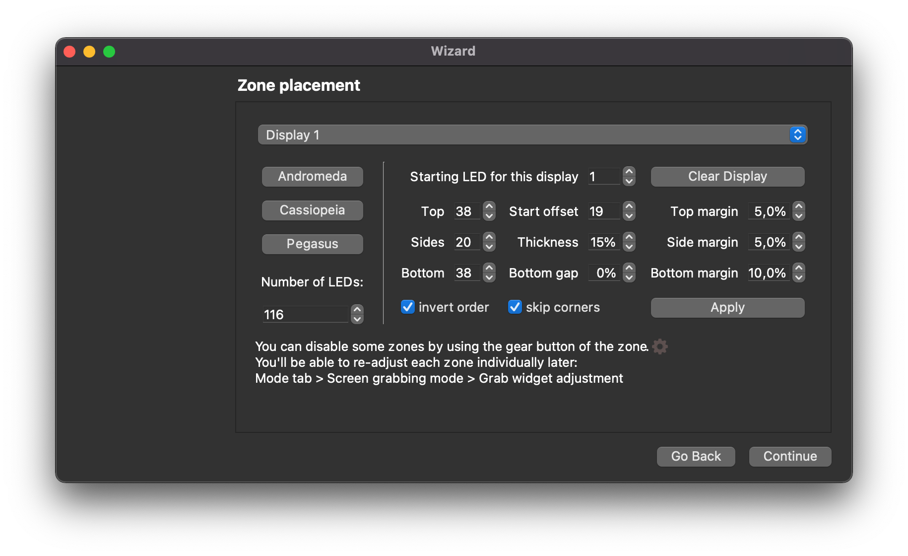

## Configuration
I have 38 diodes for each top and bottom strip and 20 diodes for each side. In total it's 116.
Here is my example of configuration:

## Logs from uploading to my ESP
Serial port /dev/cu.usbserial-1430
Connecting....
Chip is ESP8266EX
Features: WiFi
Crystal is 26MHz
MAC: dc:4f:22:1c:95:27
Uploading stub...
Running stub...
Stub running...
Changing baud rate to 230400
Changed.
Configuring flash size...
Auto-detected Flash size: 4MB
Flash params set to 0x0340
Compressed 268480 bytes to 197854...
Wrote 268480 bytes (197854 compressed) at 0x00000000 in 9.7 seconds (effective 221.4 kbit/s)...
Hash of data verified.

Leaving...
Hard resetting via RTS pin..
